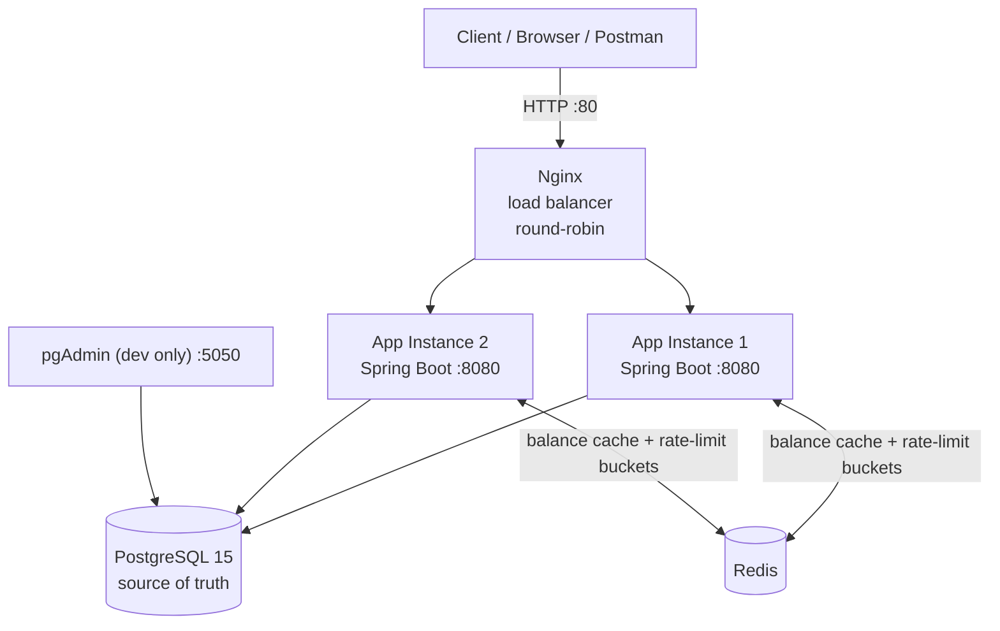

# FinLedger

FinLedger is a secure, horizontally-scalable financial ledger backend built with **Java 17, Spring Boot 3, PostgreSQL, and Redis**. It implements double-entry bookkeeping, idempotent transactions, optimistic concurrency control, a tamper-evident cryptographically linked audit trail, Redis-backed distributed rate limiting, and load-balanced multi-instance deployment.

[](https://openjdk.org/projects/jdk/17/)
[](https://spring.io/projects/spring-boot)
[](https://www.postgresql.org/)
[](https://redis.io/)
[](https://docs.docker.com/compose/)

---

## Table of Contents

- [Overview](#overview)
- [Key Features](#key-features)
- [Architecture](#architecture)
- [Core Financial Model](#core-financial-model)
- [Transaction Integrity](#transaction-integrity)
- [Cryptographic Audit Trail](#cryptographic-audit-trail)
- [Security](#security)
- [Redis](#redis)
- [Database](#database)
- [API Reference](#api-reference)
- [Project Structure](#project-structure)
- [Tech Stack](#tech-stack)
- [Prerequisites](#prerequisites)
- [Environment Configuration](#environment-configuration)
- [Running Locally](#running-locally)
- [Running Tests](#running-tests)
- [Docker Deployment](#docker-deployment)
- [Scalability and Reliability](#scalability-and-reliability)
- [Testing Strategy](#testing-strategy)
- [Engineering Decisions](#engineering-decisions)
- [Potential Future Improvements](#potential-future-improvements)
- [License](#license)

---

## Overview

FinLedger addresses the core problems of any money-movement system:

- **Correctness** — every operation writes a balanced debit/credit pair inside a single atomic database transaction.
- **Deduplication** — network retries and double-clicks cannot double-spend money.
- **Concurrency** — simultaneous balance updates across processes never lose an update.
- **Auditability** — ledger history is hash-chained so tampering is detectable and precisely locatable.
- **Multi-tenancy** — per-user accounts are isolated by both role checks and explicit ownership verification.
- **Scaling** — the application is stateless and horizontally deployable behind a load balancer; shared state lives in Redis.

---

## Key Features

- Double-entry bookkeeping (two balanced ledger entries per transaction)
- Idempotent transaction processing via a unique client-supplied `referenceId`
- Optimistic locking (`@Version`) with automatic retry on conflict
- Cryptographically linked (SHA-256) per-account audit trail with an admin verification endpoint
- Redis-backed distributed rate limiting (Bucket4j token buckets)
- Redis balance caching with owner-ID verification and graceful fallback
- JWT-based stateless authentication (cookie and `Authorization` header)
- Role-based access control (`ROLE_USER` / `ROLE_ADMIN`) and per-request ownership checks
- Bean Validation on all request payloads with a global exception handler
- Paginated, sortable account statements
- Multi-instance Docker deployment behind an Nginx load balancer
- GitHub Actions CI (unit tests → build) and Swagger/OpenAPI docs

---

## Architecture



### Layered application design

```
Controllers  →  Rate-limit check  →  Services  →  Repositories  →  PostgreSQL
                                           ↕
                                         Redis
```
- **Controllers** — HTTP surface, authentication extraction, rate-limit enforcement, validation.
- **Services** — all business logic: double-entry writes, hash chaining, cache invalidation, ownership checks, retries.
- **Repositories** — Spring Data JPA interfaces.
- **Redis** — balance cache (with owner verification) and distributed rate-limit state.
- **PostgreSQL** — the system of record; transactions guarantee atomicity of debit/credit writes.

The application instances are **stateless** (JWT is self-contained, no server-side sessions), so any request can be served by any instance. Convergent state — rate-limit buckets and cached balances — is shared through Redis; authoritative state stays in PostgreSQL.

---

## Core Financial Model

Every financial operation flows through the same `transfer()` path and writes **exactly two ledger entries** — a debit and a credit — inside one `@Transactional` method. There is no code path that writes only one entry.

```
Transfer ₹1,000 from Alice → Bob

  LedgerEntry #1 │ account = Alice  │ amount = −1,000 │  (debit)
  LedgerEntry #2 │ account = Bob    │ amount = +1,000 │  (credit)
```

- **Deposit** → `CENTRAL_BANK` → user account
- **Withdrawal** → user account → `CENTRAL_BANK`
- **Transfer** → account A → account B

A `CENTRAL_BANK` account is seeded at startup and acts as the system's single counterparty for deposits and withdrawals. It is exempt from both the ownership check and the balance check, so its balance is the exact negative of the money in circulation — the sum of all account balances is always zero.

Balances are **denormalized** on `accounts` for fast reads; the `ledger_entries` rows written by each transaction are the authoritative, immutable history. Amounts are stored as `BigDecimal` with precision `19, scale 4`.

---

## Transaction Integrity

| Mechanism | Implementation |
|---|---|
| **Idempotency** | Client supplies a unique `referenceId`. The application checks for an existing transaction (fast fail) *and* the `reference_id` column carries a `UNIQUE` database constraint. Duplicate requests return `409 Conflict` — money can never be moved twice by the same reference. |
| **Atomicity** | Both ledger entries, the transaction record, and both balance updates are written in a single `@Transactional` unit. Any failure rolls back everything. |
| **Concurrency control** | `Account` carries a `@Version` field; Hibernate rejects stale updates with `ObjectOptimisticLockingFailureException`. `@Retryable` re-reads and retries up to **3 times with a 1s backoff**. No pessimistic locks, no throughput bottleneck. |
| **Validation** | Amount must be positive; both accounts must exist; sender must be the authenticated user (or `CENTRAL_BANK`); funds must be sufficient. |
| **Cache coherence** | Both sender and receiver balance cache keys are deleted after every mutation. |

---

## Cryptographic Audit Trail

Each `LedgerEntry` stores its own SHA-256 hash plus the previous entry's hash, forming a per-account chain. The content hashed is: `previousHash + amount + referenceId + loggedAt`.

```
Entry #1 │ prevHash = "MANK_1008"            ← genesis anchor
         │ hash = SHA-256(prevHash + amount + reference + timestamp)

Entry #2 │ prevHash = hash(Entry #1)
         │ hash = SHA-256(prevHash + amount + reference + timestamp)

Entry #3 │ prevHash = hash(Entry #2)
         │ ...
```

`GET /api/admin/audit/{accountId}` (ADMIN only) replays the chain oldest → newest and checks:
1. **Chain link** — does each entry's `prevHash` equal the previous entry's hash?
2. **Content integrity** — does the recomputed hash match the stored hash?

A mismatch returns `CORRUPTED: BROKEN CHAIN` or `CORRUPTED: DATA MODIFIED`, along with the exact `ledgerId` where corruption was detected; a clean chain returns `VALID`.

This provides a **tamper-evident, cryptographically linked audit trail**: silent modification of historical records is detectable on verification. It is not a blockchain and does not provide consensus, decentralization, or immutability outside the database's control.

---

## Security

| Layer | Implementation |
|---|---|
| **Authentication** | JWT signed via JJWT (HMAC-SHA; the algorithm is derived from the signing-secret length — the bundled dev secret yields HS512). Tokens are accepted from a cookie *or* the `Authorization: Bearer` header (the header variant exists for Swagger/Postman). |
| **Cookie settings** | Cookie name is `spring.app.jwtCookieName` (dev default `FinLedger`), path `/api`, max-age 24h. Note: the cookie is explicitly **not** `HttpOnly` in the current implementation — the JWT is also returned in the sign-in response body. Hardening options are listed under [Future Improvements](#potential-future-improvements). |
| **Statelessness** | `SessionCreationPolicy.STATELESS`; no server-side session store, no CSRF session token. CSRF protection is disabled (documented trade-off for the cookie mode). |
| **Passwords** | BCrypt (`BCryptPasswordEncoder`, default strength 10). |
| **Authorization** | Method-level `@PreAuthorize` (e.g. `ROLE_ADMIN` on the audit endpoint) plus service-layer ownership checks: a user may only act on accounts they own, and only `CENTRAL_BANK` bypasses ownership. Unauthenticated requests are rejected with a structured 401 via `AuthEntryPointJwt`; authenticated requests lacking the required role are rejected with a structured 403 via `AuthAccessDeniedHandler`. |
| **CORS** | Allows `http://localhost:5173` with credentials. |
| **Error responses** | A global `@RestControllerAdvice` maps validation, not-found, duplicate, insufficient-funds, and invalid-operation conditions to consistent JSON. Unauthenticated requests get a structured 401 via `AuthEntryPointJwt`. |
| **Rate limiting** | Per-user distributed limits (see [Redis](#redis)). |

### Seeded default admin

On first startup, `DataSeeder` creates the `ROLE_USER`/`ROLE_ADMIN` roles, an admin user, and the `CENTRAL_BANK` account:

| Username | Password | Roles |
|---|---|---|
| `systemAdmin` | `pass123` | `ROLE_ADMIN` + `ROLE_USER` |

> These defaults are hardcoded for development and must be changed before any production use.

---

## Redis

Redis has two distinct responsibilities.

### 1. Balance caching

- Key: `balance:{accountId}`, value: `AccountCacheDTO { ownerId, balance }`, **TTL 10 minutes**.
- The `ownerId` is verified against the authenticated user on every cache hit, so one user's cached balance can never be served to another.
- On transfer, both the sender and receiver cache keys are invalidated.
- Any Redis failure (read or write) is logged and the request **falls back to PostgreSQL** — zero user impact.

### 2. Distributed rate limiting

- Bucket4j token buckets, state held in Redis through a **CAS-based Lettuce `ProxyManager`** — so limits hold across all application instances.
- Key: `rate_limit:{TYPE}:{userId}`.

| Category | Limit | Refill | Applied to |
|---|---|---|---|
| `GENERAL` | 10 tokens | Greedy (bursts allowed) | account create, list, balance, statement |
| `TRANSACTION` | 1 token | Intervally (strict, no bursts) | transfer, deposit, withdraw |

Buckets idle for more than 10 minutes expire (`ExpirationAfterWriteStrategy` based on refill time). Because buckets live in Redis, alternating requests between `app1` and `app2` cannot bypass the transaction limit.

---

## Database

PostgreSQL 15, accessed through Spring Data JPA/Hibernate. UUID primary keys; amounts are `BigDecimal(19,4)`.

| Entity | Table | Notes |
|---|---|---|
| `User` | `users` | unique `username`, unique `email`, BCrypt `password` |
| `Role` | `roles` | `ROLE_USER`, `ROLE_ADMIN` |
| — | `user_role` | Many-to-many join |
| `Account` | `accounts` | `@Version` for optimistic locking; `balance`; `currency`; owner FK to `users` |
| `Transaction` | `transaction` | **unique** `reference_id` (idempotency key); `type`, `status`, `timestamp` |
| `LedgerEntry` | `ledgerEntries` | `amount`, `hash`, `previous_hash`, FKs to account + transaction |

Relationships: one user → many accounts; one transaction → two ledger entries (one per account); one account → many ledger entries (its full history).

**Migration strategy:** the schema is generated by Hibernate (`ddl-auto=update`). There is **no Flyway/Liquibase migration tool** in this project.

---

## API Reference

Interactive docs: `http://localhost/swagger-ui.html` (base path `/v3/api-docs`). All endpoints below are taken directly from the controllers.

### Authentication — `/api/auth`

| Method | Endpoint | Auth | Description |
|---|---|---|---|
| POST | `/api/auth/signup` | Public | Register a user (always assigned `ROLE_USER`) |
| POST | `/api/auth/signin` | Public | Login; returns JWT in body + sets cookie |
| GET | `/api/auth/username` | Authenticated | Current username |
| GET | `/api/auth/user` | Authenticated | Current user id + username |
| POST | `/api/auth/signout` | Authenticated | Clears the JWT cookie |

### Banking operations — `/api`

| Method | Endpoint | Auth | Rate limit | Description |
|---|---|---|---|---|
| POST | `/api/account/create` | User | GENERAL | Create an account `{accountName, currency}` (3-letter ISO code) |
| GET | `/api/account/list` | User | GENERAL | List your accounts |
| GET | `/api/account/balance/{accountId}` | User | GENERAL | Balance (Redis-cached, ownership-verified) |
| GET | `/api/statement/{accountId}` | User | GENERAL | Paginated statement; params `pageNumber`, `pageSize`, `sortBy`, `sortOrder` |
| POST | `/api/deposit` | User | TRANSACTION | `{toAccountId, amount, referenceId}` — from `CENTRAL_BANK` |
| POST | `/api/withdraw` | User | TRANSACTION | `{fromAccountId, amount, referenceId}` — to `CENTRAL_BANK` |
| POST | `/api/transfer` | User | TRANSACTION | `{fromAccountId, toAccountId, amount, referenceId}` |

### Administration

| Method | Endpoint | Auth | Description |
|---|---|---|---|
| GET | `/api/admin/audit/{accountId}` | `ROLE_ADMIN` | Verify hash-chain integrity of an account's ledger |

### Development/debug endpoints

`/test-cache/{value}`, `/get-cache`, `/test-serializer` are debug helpers from the controllers for exercising the Redis template and JSON serializer. They are authenticated and are not part of the product API.

### Example — transfer

```bash
curl -X POST http://localhost/api/transfer \
  -H "Content-Type: application/json" \
  -H "Authorization: Bearer <JWT>" \
  -d '{
    "fromAccountId": "<sender-account-id>",
    "toAccountId":   "<receiver-account-id>",
    "amount":        1500.00,
    "referenceId":   "TXN-20260315-001"
  }'
```

```json
{ "message": "Transfer successful", "status": true }
```

Repeating the same `referenceId` returns `409 Conflict`. A statement uses derived CREDIT/DEBIT types (positive amount → `CREDIT`, negative → `DEBIT`).

---

## Project Structure

```
src/
├── main/
│   ├── java/com/example/finledger/
│   │   ├── FinLedgerApplication.java   # @SpringBootApplication + @EnableRetry
│   │   ├── DataSeeder.java             # Roles, systemAdmin, CENTRAL_BANK on first run
│   │   ├── config/                     # AppConst (pagination defaults)
│   │   ├── controller/                 # Auth, Account, Admin, dev-test controllers
│   │   ├── service/                    # AccountService(+Impl), AdminService(+Impl), RateLimitingService
│   │   ├── repositories/               # Spring Data JPA interfaces
│   │   ├── model/                      # User, Role, Account, Transaction, LedgerEntry, AppRoles
│   │   ├── Payloads/                   # Request DTOs and response wrappers
│   │   ├── enums/                      # TransactionType, TransactionStatus, RateLimitType
│   │   ├── Exceptions/                 # Domain exceptions + global @RestControllerAdvice
│   │   ├── Security/
│   │   │   ├── Config/                 # WebSecurityConfig, RedisConfig (Lettuce + Bucket4j ProxyManager)
│   │   │   ├── jwt/                    # JwtUtils, AuthTokenFilter, AuthEntryPointJwt
│   │   │   ├── Services/               # UserDetailsServiceImpl/Impl
│   │   │   ├── Request/ Response/      # Auth DTOs
│   │   ├── utils/                      # AuthUtils, HashUtils (SHA-256)
│   │   └── tools/                      # HackerAttack (dev concurrency load tool)
│   └── resources/
│       ├── application.properties.example
│       └── logback.xml
├── test/
│   └── java/com/example/finledger/     # Unit tests (service + security)
├── Dockerfile                           # Multi-stage build
├── docker-compose.yml                   # 6-service stack + Nginx LB
├── nginx.conf                           # Round-robin upstream config
└── finledger_erd.png                    # Entity-relationship diagram
```

---

## Tech Stack

| Category | Technology |
|---|---|
| Language | Java 17 |
| Framework | Spring Boot 3.3.5 (Web, Security, Data JPA, Validation, Data Redis, Batch) |
| Security | Spring Security + JJWT 0.13 |
| ORM | Spring Data JPA / Hibernate |
| Database | PostgreSQL 15 |
| Cache / distributed state | Redis with Lettuce |
| Rate limiting | Bucket4j 8.16 (Lettuce backend) |
| Retry | Spring Retry + Aspects |
| API docs | SpringDoc OpenAPI 2.6.0 |
| Build | Maven 3.9.12 (wrapper) |
| Containerization | Docker (multi-stage, Temurin 17) |
| Orchestration | Docker Compose |
| Load balancer | Nginx (round-robin) |
| CI/CD | GitHub Actions |
| Testing | JUnit 5 + Mockito + Spring Security Test |

The `modelmapper` and `spring-batch-test` dependencies are declared in `pom.xml` but are not currently used by application code.

---

## Prerequisites

- Docker and Docker Compose (recommended path)
- *For local development only:* JDK 17 and Maven (or just use the bundled `./mvnw` wrapper)

---

## Environment Configuration

Copy the template and fill in your values:

```bash
cp src/main/resources/application.properties.example src/main/resources/application.properties
```

| Variable | Purpose | Example / Default |
|---|---|---|
| `spring.datasource.url` / `SPRING_DATASOURCE_URL` | PostgreSQL JDBC URL | `jdbc:postgresql://localhost:5432/finledger_db` |
| `spring.datasource.username` | DB user | `postgres` |
| `spring.datasource.password` | DB password | `<your-password>` |
| `spring.data.redis.host` / `SPRING_DATA_REDIS_HOST` | Redis host | `localhost` |
| `spring.data.redis.port` | Redis port | `6379` |
| `spring.app.jwtSecret` / `SPRING_APP_JWTSECRET` | Base64-encoded HMAC secret for JWT signing | `<your-secret>` |
| `spring.app.jwtExpirationMs` | JWT lifetime | `3600000` |
| `spring.app.jwtCookieName` | Cookie name carrying the JWT | `FinLedger` |
| `spring.jpa.hibernate.ddl-auto` | Schema generation | `update` |

> **Never commit a real secret.** The values in `docker-compose.yml` are throwaway developer defaults for the local stack only.

---

## Running Locally

### Option 1 — Docker Compose (full stack)

```bash
git clone <repository-url>
cd finledger
docker compose up --build
```

| URL | Service |
|---|---|
| `http://localhost` | Application (via Nginx load balancer) |
| `http://localhost/swagger-ui.html` | Interactive API docs |
| `http://localhost:5050` | pgAdmin (`admin@admin.com` / `admin`) |

The two app instances are **not** published on host ports — traffic enters exclusively through Nginx on port 80. PostgreSQL (`5432`) and Redis (`6379`) are exposed for tooling.

### Option 2 — Local development

```bash
# Start only the infrastructure
docker compose up -d postgres redis

# Configure, then run
cp src/main/resources/application.properties.example src/main/resources/application.properties
./mvnw spring-boot:run
```

### Smoke test

```bash
# 1. Register
curl -X POST http://localhost/api/auth/signup \
  -H "Content-Type: application/json" \
  -d '{"username":"alice","password":"pass123","email":"alice@test.com"}'

# 2. Login — take the JWT from the response body
curl -X POST http://localhost/api/auth/signin \
  -H "Content-Type: application/json" \
  -d '{"username":"alice","password":"pass123"}'

# 3. Create an account and deposit (use the JWT in the Authorization header)
curl -X POST http://localhost/api/account/create \
  -H "Content-Type: application/json" \
  -H "Authorization: Bearer <JWT>" \
  -d '{"accountName":"AliceSavings","currency":"INR"}'
```

---

## Running Tests

The suite is pure unit tests (mocked dependencies) — no database or Redis is required.

```bash
./mvnw clean test          # all tests
./mvnw test -Dtest=AccountServiceImplTest   # single class
```

---

## Docker Deployment

The `Dockerfile` is a two-stage build: Maven compiles and packages `target/FinLedger-0.0.1-SNAPSHOT.jar` in a full Temurin 17 JDK image; the run stage is a slim Temurin 17 JRE that only receives the JAR. The final image contains no build tooling.

`docker-compose.yml` runs six services on a single bridge network:

| Service | Image | Purpose |
|---|---|---|
| `postgres` | `postgres:15-alpine` | Relational store; named volume `finledger_postgres_data` |
| `redis` | `redis:alpine` | Caching + distributed rate-limit buckets |
| `app1`, `app2` | local multi-stage build | Two identical Spring Boot instances |
| `nginx` | `nginx:alpine` | Round-robin load balancer (`nginx.conf` upstream → `app1:8080`, `app2:8080`) |
| `pgadmin` | `dpage/pgadmin4` | Database UI (dev only) |

Both app instances share the same environment, dataset, Redis, and PostgreSQL via a single named network.

---

## Scalability and Reliability

Mechanisms that support horizontal scaling and data integrity:

- **Stateless application** — JWT is self-contained; Nginx can route any request to any instance.
- **Shared rate-limit state in Redis** — transaction limits hold regardless of which instance serves a request.
- **Shared cache with ownership verification** — safe balance reads from any instance.
- **Optimistic locking + retry** — concurrent balance updates on the same account are serialized at the row version level, not by application locks; conflicts are retried automatically.
- **Idempotency keys** — duplicate submissions are rejected consistently by any instance.
- **Single source of truth** — all mutations are atomic in PostgreSQL.

These make the system **horizontally scalable behind the load balancer** and consistent under concurrent writes. No claims are made here about benchmarked throughput or production readiness — those depend on hardware, tuning, and operator infrastructure.

---

## Testing Strategy

29 JUnit 5 + Mockito tests across five test classes. The service tests mock all dependencies (`@ExtendWith(MockitoExtension.class)`), so tests run without external services and are CI-friendly. The `AdminControllerAuthorizationTest` web-layer tests cover the admin-endpoint authorization matrix (unauthenticated → 401, `ROLE_USER` → 403, `ROLE_ADMIN` → 200).

| Test class | Tests | Coverage |
|---|---|---|
| `AccountServiceImplTest` | 21 | Transfer (zero/negative amount, duplicate `referenceId`, missing accounts, unauthorized sender, insufficient funds, `CENTRAL_BANK` bypass, success + cache invalidation), Deposit (missing account, unauthorized, missing vault, delegates to transfer), Balance (cache hit owner-match, cache hit owner-mismatch, cache miss + populate, Redis read/write failure → DB fallback), Statement (missing account, unauthorized, CREDIT/DEBIT derivation) |
| `AdminServiceImplTest` | 3 | Audit: valid chain, broken link, tampered data |
| `AuthEntryPointJwtTest` | 1 | 401 response shape |
| `AuthAccessDeniedHandlerTest` | 1 | 403 response shape |
| `AdminControllerAuthorizationTest` | 3 | Admin endpoint: unauthenticated → 401, `ROLE_USER` → 403, `ROLE_ADMIN` → 200 |

Techniques: `@Spy @InjectMocks` (verifies `deposit` delegates to `transfer`), `ArgumentCaptor` (asserts exact saved entity values), `doThrow` (`RedisConnectionFailureException` for graceful-degradation paths).

There are currently **no integration tests or Testcontainers setups** — this is a deliberate future improvement rather than an implementation detail of production code.

---

## Engineering Decisions

### Why PostgreSQL + relational model?
Financial data demands ACID transactions. A transfer must atomically write two ledger entries and two balance updates; a relational database provides the guarantees and the unique constraints needed for money movement.

### Why `BigDecimal` for money?
Floating-point types (`float`/`double`) cannot represent decimal money exactly. `BigDecimal(19,4)` gives exact arithmetic and a fixed scale.

### Why optimistic locking instead of pessimistic locks?
Pessimistic locking serializes concurrent transfers and destroys throughput. A `@Version` column lets conflicting transactions fail fast and retry, keeping concurrent users independent in the common case.

### Why client-supplied `referenceId` idempotency?
Network retries, double-clicks, and webhooks can resubmit the same request. A unique `referenceId` (with a DB `UNIQUE` constraint) makes "at-most-once" a database guarantee, not a hope.

### Why Redis?
Two separate, cross-instance problems: (1) caching hot balance reads with a short TTL, and (2) holding rate-limit buckets in one place so limits are meaningful behind a load balancer. Localized failure degrades to the database automatically.

### Why per-account hash chaining?
It turns the ledger into a **tamper-evident audit log**: any modification to an entry breaks its hash, which cascades to the next entry's `prevHash`. The audit endpoint pinpoints the exact corrupted entry. It is an integrity mechanism, not a consensus system.

### Why JWT cookies *and* Bearer header?
Cookies give browsers automatic, credential-safe transport; the header variant keeps Swagger/Postman usable and supports non-browser clients. Both parse paths are enforced by the same `AuthTokenFilter`.

---

## Potential Future Improvements

- Integration and end-to-end tests with Testcontainers (PostgreSQL + Redis), including concurrent-transfer scenarios.
- Replace Hibernate `ddl-auto=update` with versioned migrations (Flyway/Liquibase).
- Harden the JWT cookie: add `HttpOnly`, `Secure`, and `SameSite` and re-evaluate CSRF posture.
- External secret management (env-sealed secrets, Vault/KMS) instead of config-file/compose defaults.
- Observability: Actuator endpoints, Micrometer metrics, structured logging, distributed tracing.
- Derive/enforce ledger ordering with an explicit indexed ordering column to make the hash chain iteration fully deterministic.
- Introduce actual Spring Batch jobs (dependency is present but unused) or remove the unused starter/model-mapper dependencies.
- Kubernetes deployment with a service mesh, autoscaling, and probes.

---

## License

No license file is present in this repository.